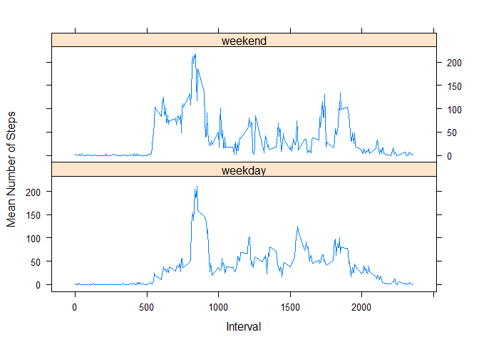

## Loading and preprocessing the data

```r
library(data.table)
```

```
## Warning: package 'data.table' was built under R version 3.4.4
```

```r
library(ggplot2)
```

```
## Warning: package 'ggplot2' was built under R version 3.4.4
```

```r
library(lattice)
```

```
## Warning: package 'lattice' was built under R version 3.4.4
```

```r
library(dplyr)
```

```
## Warning: package 'dplyr' was built under R version 3.4.4
```


```r
# Load the CSV RAW Data File
#setwd("D:\\RData\\Course5\\data")
df <- read.csv("activity.csv")
dt <- data.table(df)
dt$date<- as.Date(dt$date,"%Y-%m-%d")
```

## What is mean total number of steps taken per day?

1. Calculate the total number of steps taken per day


```r
steps_per_day <- dt[complete.cases(dt),] %>% 
  group_by(date) %>% 
  summarize("Total_Steps"=sum(steps))
```
2. Make a histogram of the total number of steps taken each day

```r
hist(steps_per_day$Total_Steps , xlab = "Step" , ylab = "Frequency" , col="blue" , main="Total           Number of Steps taken Per day" , breaks=10 , xlim = c(0,22000),ylim = c(0,18) , labels=TRUE)
rug(steps_per_day$Total_Steps )
```

<!-- -->

3. Calculate and report the mean and median of the total number of steps taken per day
  

```r
        ## Calculate but save for use later
        mean_median <- 
                dt[complete.cases(dt),] %>% 
                        group_by(date) %>% 
                        summarize("Mean"=mean(steps),"Median"=median(steps))
```

```
## Warning: package 'bindrcpp' was built under R version 3.4.4
```

```r
        str(mean_median)
```

```
## Classes 'tbl_df', 'tbl' and 'data.frame':	53 obs. of  3 variables:
##  $ date  : Date, format: "2012-10-02" "2012-10-03" ...
##  $ Mean  : num  0.438 39.417 42.069 46.16 53.542 ...
##  $ Median: num  0 0 0 0 0 0 0 0 0 0 ...
##  - attr(*, ".internal.selfref")=<externalptr>
```

## What is the average daily activity pattern?
1. Make a time series plot (i.e. \color{red}{\verb|type = "l"|}type="l") of the 5-minute interval (x-axis) and the average number of steps taken, averaged across all days (y-axis)

<!-- -->

2. Which 5-minute interval, on average across all the days in the dataset, contains the maximum number of steps?


```r
        x <- daily_activity[daily_activity$Mean==max(daily_activity$Mean),1]
        cat("Interval with Maximum mean of all days =",as.character(x))
```

```
## Interval with Maximum mean of all days = 835
```


## Imputing missing values
1. Calculate and report the total number of missing values in the dataset (i.e. the total number of rows with \color{red}{\verb|NA|}NAs)


```r
        x <- sum(!complete.cases(dt))
        cat("Number of rows with missing values =",as.character(x))
```

```
## Number of rows with missing values = 2304
```

2. Devise a strategy for filling in all of the missing values in the dataset. The strategy does not need to be sophisticated. For example, you could use the mean/median for that day, or the mean for that 5-minute interval, etc.

```r
print ("Fill the Missing Values with the mean of the interval of the day")
```

```
## [1] "Fill the Missing Values with the mean of the interval of the day"
```

3. Create a new dataset that is equal to the original dataset but with the missing data filled in.


```r
        daily_activity <- as.data.frame(daily_activity)
        

        result <- dt

        ## Finding and Replacing Missing VALUES  - with Mean Values of the intervals
        for (i in 1:nrow(result)) {
                if (is.na(result$steps[i])) {
                        ## Lookup the mean (in daily_activity) for the interval of this row
                        val <- daily_activity[daily_activity$interval==result$interval[i],"Mean"]
                        result$steps[i]<- as.integer(round(val))
                }
        }
```

4. Make a histogram of the total number of steps taken each day and Calculate and report the mean and median total number of steps taken per day


```r
        mean_median_imp <- 
                result %>% 
                group_by(date) %>% 
                summarize("Mean"=mean(steps),"Median"=median(steps))
        mean_median_imp
```

```
## # A tibble: 61 x 3
##    date         Mean Median
##    <date>      <dbl>  <dbl>
##  1 2012-10-01 37.4     34.5
##  2 2012-10-02  0.438    0  
##  3 2012-10-03 39.4      0  
##  4 2012-10-04 42.1      0  
##  5 2012-10-05 46.2      0  
##  6 2012-10-06 53.5      0  
##  7 2012-10-07 38.2      0  
##  8 2012-10-08 37.4     34.5
##  9 2012-10-09 44.5      0  
## 10 2012-10-10 34.4      0  
## # ... with 51 more rows
```

Analyze the difference  after Imputation of missing values

```r
        summary(mean_median,2:3)
```

```
##       date                 Mean             Median 
##  Min.   :2012-10-02   Min.   : 0.1424   Min.   :0  
##  1st Qu.:2012-10-16   1st Qu.:30.6979   1st Qu.:0  
##  Median :2012-10-29   Median :37.3785   Median :0  
##  Mean   :2012-10-30   Mean   :37.3826   Mean   :0  
##  3rd Qu.:2012-11-16   3rd Qu.:46.1597   3rd Qu.:0  
##  Max.   :2012-11-29   Max.   :73.5903   Max.   :0
```

```r
        summary(mean_median_imp,2:3)
```

```
##       date                 Mean             Median      
##  Min.   :2012-10-01   Min.   : 0.1424   Min.   : 0.000  
##  1st Qu.:2012-10-16   1st Qu.:34.0938   1st Qu.: 0.000  
##  Median :2012-10-31   Median :37.3681   Median : 0.000  
##  Mean   :2012-10-31   Mean   :37.3807   Mean   : 4.525  
##  3rd Qu.:2012-11-15   3rd Qu.:44.4826   3rd Qu.: 0.000  
##  Max.   :2012-11-30   Max.   :73.5903   Max.   :34.500
```
Plot side by side plots before aqnd after imputation

```r
        plot.new()
        par(mfrow=c(1,2) )
        
        step_summary <- dt[complete.cases(dt),] %>% 
                group_by(date) %>% 
                summarize("Total_Steps"=sum(steps))
        
        hist(step_summary$Total_Steps,col="blue",
             main="Avg. Daily Steps Before Imputation",
             xlab="Total Steps"
             )
        
        step_summary <-result %>%
                group_by(date) %>% 
                summarize("Total_Steps"=sum(steps))
        
        hist(step_summary$Total_Steps,col="green",
             main="Avg. Daily Steps After Imputation",
             xlab="Total Steps"
             )
```

<!-- -->

## Are there differences in activity patterns between weekdays and weekends?

1. Create a new factor variable in the dataset with two levels - "weekday" and "weekend" indicating whether a given date is a weekday or weekend day.


```r
        DayOfWeek <- data.frame(
                name=c("Monday","Tuesday","Wednesday","Thursday","Friday","Saturday","Sunday"),
                part=c("weekday","weekday","weekday","weekday","weekday","weekend","weekend"))
       
        # Parse the Date to Names of the Week days and assign the FACTOR value from the Data Frame         of DaysOfWeek
        result$week_factor <- as.factor(weekdays(result$date))
        result$week_factor <- DayOfWeek[result$week_factor,2]
```

2. Make a panel plot containing a time series plot (i.e. type = "l") of the 5-minute interval (x-axis) and the average number of steps taken, averaged across all weekday days or weekend days (y-axis). 


```r
        ## Calculate and store the means by group
        plot <- result %>% 
                group_by(week_factor,interval) %>% 
                summarize("Mean"=mean(steps))
        
        
        xyplot(plot$Mean ~ plot$interval | plot$week_factor, 
               data=plot, type="l", layout=c(1:2),
               ylab="Mean Number of Steps",
               xlab="Interval")
```

<!-- -->
